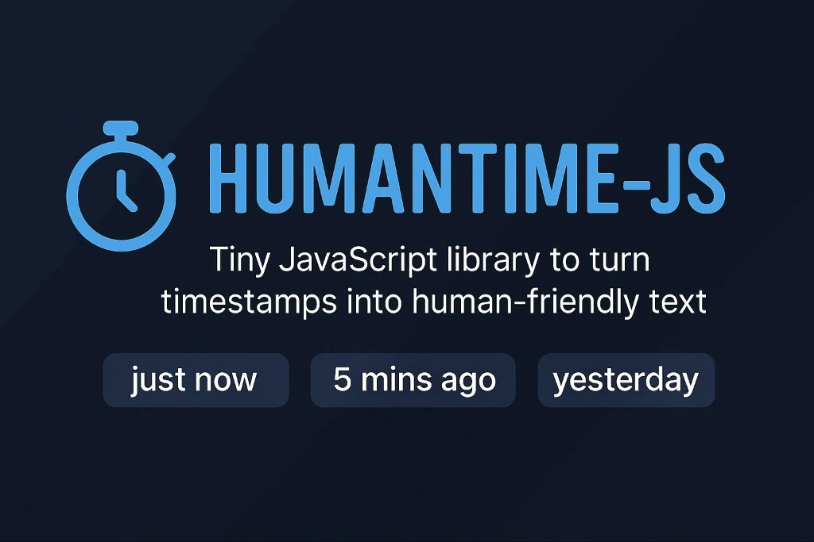

<p align="center">
  
</p>

# ⏱️ humantime-js

[](https://www.npmjs.com/package/humantime-js)
[](LICENSE)
[](https://bundlephobia.com/result?p=humantime-js)

> ⚡ A tiny JavaScript library to turn timestamps into friendly phrases like **"just now"**, **"5 mins ago"**, or **"yesterday"**.
---

## ✨ Features
✅ Ultra lightweight (under 1 KB) 
✅ Zero dependencies  
✅ Works seamlessly in Node.js & browsers  
✅ Simple, clean & human-friendly  
✅ Quick to use and easy to customize
---


## 📦 Installation
```bash
npm install humantime-js
```
or with yarn
```bash
yarn add humantime-js
```

## 🚀 Usage
```bash
import { timeAgo } from 'humantime-js';

// Example: 3 minutes ago
console.log(timeAgo(new Date(Date.now() - 3 * 60 * 1000))); // "3 mins ago"

// Example: just now
console.log(timeAgo(new Date())); // "just now"
```
>✨ Make your UI, blog, feed, or dashboard feel more alive and user-friendly!

## 📜 API
```
timeAgo(date: Date): string
```
Takes a JavaScript ``` Date ```object and returns a human-readable relative time string.

## 🛠️ Build & Test
```bash
npm run build       # Build the library with Rollup
npm test            # Run tests with Jest
```
## 🤝 Contributing
Contributions, issues and feature requests are welcome!
Feel free to open an issue or submit a pull request.

If you like this project, consider leaving a ⭐ to show your support!

## 📄 License
MIT © 2025 Agyare Kelvin Yeboah

## 🌟 Why humantime-js?
Because your users deserve text that feels natural, familiar, and human – not robotic timestamps.


## 📬 Let’s Connect  

Have feedback, ideas, or just want to chat? Reach out to me:  
<div>
  <a href="mailto:onlykelvin06@gmail.com">
    
  </a>
  <a href="https://www.instagram.com/_.yo.kelvin/">
    
  </a>
  <a href="https://www.youtube.com/@TechTutor_Tv?sub_confirmation=1">
    
  </a>
  <a href = "https://www.linkedin.com/in/kelvin-agyare-yeboah-6728a7301?utm_source=share&utm_campaign=share_via&utm_content=profile&utm_medium=android_app">
    
  </a>
  <a href="https://github.com/KelvCodes">
    
  </a>
</div>     
